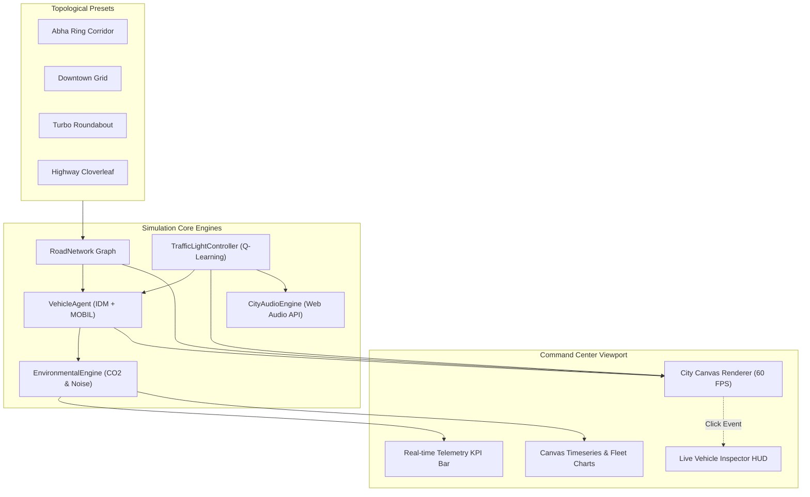

# 🚦 EcoTraffic UrbanAI | Smart City Digital Twin & Multi-Agent Traffic AI

[](https://tareq0001.github.io/EcoTraffic-UrbanAI-Simulator/)
[](LICENSE)
[](https://tareq0001.github.io/EcoTraffic-UrbanAI-Simulator/)
[](python/traffic_qlearning_train.py)
[](types/ecotraffic.d.ts)
[](sql/smart_city_traffic_schema.sql)

> **EcoTraffic UrbanAI** is a high-fidelity **Smart City Digital Twin** and **Microscopic Multi-Agent Traffic Simulator** running **100% directly inside modern web browsers with zero servers, zero external databases, and zero configuration**. Powered by real-time **Intelligent Driver Model (IDM)** kinematics, **MOBIL** lane-changing algorithms, **Reinforcement Learning (Q-Learning)** traffic signal controllers, and **dynamic carbon emission tracking**.

---

## 🌟 Key Features & Engineering Innovations

### 1. 🏎️ Microscopic Vehicle Kinematics (IDM & MOBIL)
- **Intelligent Driver Model (IDM):** Continuous car-following acceleration equations modeling human reaction latency, comfortable braking, and shockwave phantom jams.
  $$\dot{v} = a \left[ 1 - \left(\frac{v}{v_0}\right)^\delta - \left(\frac{s^*(v, \Delta v)}{s}\right)^2 \right]$$
  $$s^*(v, \Delta v) = s_0 + v T + \frac{v \Delta v}{2\sqrt{ab}}$$
- **MOBIL Lane Changing:** Minimizing Overall Braking Induced by Lane changes, evaluating incentive criteria against safety thresholds.
- **Heterogeneous Vehicle Fleet:** Simulates private Sedans, family SUVs, clean **Electric Vehicles (EVs)** with zero tailpipe emissions, City Transit Buses, Freight Delivery Trucks, and Emergency Ambulances.

### 2. 🧠 Adaptive AI Traffic Signal Control
- **Fixed-Time Mode:** Traditional sequential clock cycles (models legacy urban gridlock).
- **Actuated Sensor Mode:** Real-time queue sensor loops that dynamically skip empty green phases.
- **Q-Learning Reinforcement Learning Agent:** Discrete State-Action-Reward formulation trained to maximize total vehicle throughput while penalizing waiting time variance.
- **Emergency Green-Wave Preemption:** Detects approaching emergency ambulances within a 200px corridor and automatically clears intersecting red lights.

### 3. 🌱 Environmental Footprint & Clean Energy Analytics
- **Tailpipe $CO_2$ Computations:** Dynamic gram-per-second emissions based on instantaneous engine load, acceleration, and fuel type (Gasoline vs Diesel).
- **EV Carbon Offset Index:** Live tracking of kilograms of $CO_2$ prevented by clean electric vehicles.
- **Ambient Noise Pollution (dB):** Logarithmic acoustic model factoring traffic density and heavy vehicle rumble.
- **Congestion Index (%):** Ratio of current network speed against free-flow nominal velocity.

### 4. 🗺️ Diverse City Topology Presets
1. **Abha Ring & King Fahd Corridor (طريق الملك فهد والدائري بأبها):** Ring road layout featuring mountain avenues, boulevards, and intersecting arterials honoring the Aseer region.
2. **Metropolitan Downtown Grid (الشبكة الحضرية المركزية):** 4-way synchronized urban grid network with high-density intersections.
3. **Turbo Smart Roundabout (الدوار المروري الذكي):** Multi-lane high-throughput roundabout with directional entry/exit slipways.
4. **Highway Cloverleaf Interchange (التقاطع السريع الحر):** Grade-separated multi-level expressway with continuous free-flow bypass ramps.

### 5. 🔍 Interactive God-Mode Tools
- **Live Vehicle Inspector:** Click any car on the road to inspect its speed, acceleration, fuel type, carbon footprint, driver patience, and destination.
- **Incident & Bottleneck Spawner:** Click any lane to trigger a simulated breakdown or roadblock and watch the downstream congestion wave form!
- **Dynamic Weather Engine:** Toggle between **Clear Sun**, **Heavy Rain** (increases stopping distance and reduces speed by 22%), and **Mountain Fog**.
- **Procedural Web Audio Synthesizer:** Real-time engine revs, emergency sirens, and traffic light switch chimes with zero external audio assets.

---

## 🏗️ Architecture & Component Topology



---

## 🛠️ Multi-Language Tech Stack

| Technology | Purpose & Implementation |
| :--- | :--- |
| **JavaScript (ES6+)** | Modular simulation engines: `road-network.js`, `vehicle-agent.js`, `ai-traffic-lights.js`, `city-presets.js`, `environmental-engine.js`, `telemetry-charts.js`, `sound-effects.js`, and `app.js`. |
| **Python 3.10+** | Standalone Q-Learning reinforcement learning training script (`python/traffic_qlearning_train.py`) with Markov Decision Process queue modeling. |
| **TypeScript** | Strict domain contracts and interface specifications (`types/ecotraffic.d.ts`). |
| **SQL (PostgreSQL / SQLite)** | Relational IoT camera, telemetry logs, and incident management schema (`sql/smart_city_traffic_schema.sql`). |
| **CSS3 & HTML5** | Tesla Autopilot cyber-clean design system with custom CSS variables, responsive panels, and smooth micro-animations. |

---

## 🚀 Live Demo

Experience the digital twin directly in your browser:  
👉 **[https://tareq0001.github.io/EcoTraffic-UrbanAI-Simulator/](https://tareq0001.github.io/EcoTraffic-UrbanAI-Simulator/)**

---

## 💻 Running Locally

### Instant Web Simulator
No build tools, bundlers, or servers required. Open `index.html` in any modern web browser or serve locally:
```bash
python -m http.server 8080
```
Then open `http://localhost:8080`.

### Python Reinforcement Learning Model
To run the Q-Learning signal optimization training script:
```bash
python python/traffic_qlearning_train.py
```

---

## 👤 Author

**Tareq Ali**
- GitHub: [@Tareq0001](https://github.com/Tareq0001)

---

## 📜 License

This project is licensed under the **MIT License** - see the [LICENSE](LICENSE) file for details.
