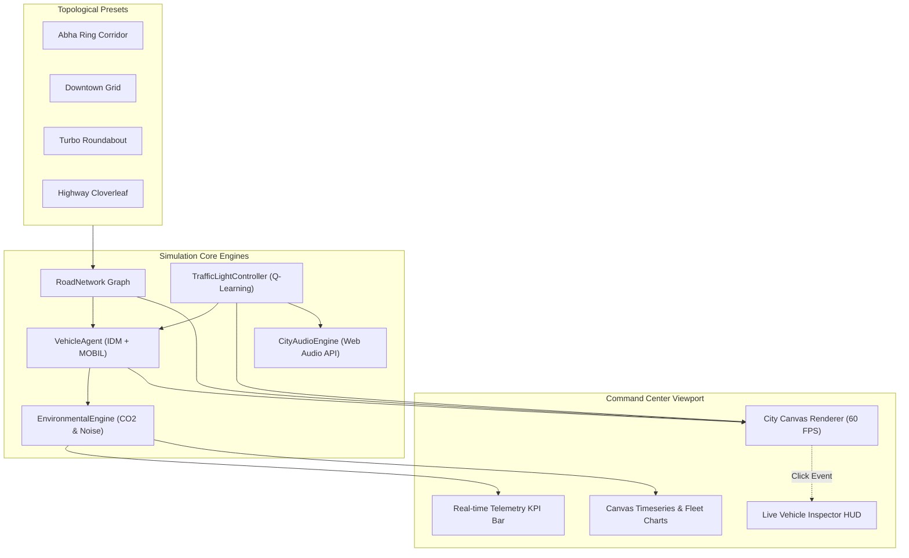

# 🚦 EcoTraffic UrbanAI | Smart City Digital Twin & Multi-Agent Traffic AI

[](https://tareq0001.github.io/EcoTraffic-UrbanAI-Simulator/)
[](LICENSE)
[](https://tareq0001.github.io/EcoTraffic-UrbanAI-Simulator/)
[](python/traffic_qlearning_train.py)
[](types/ecotraffic.d.ts)
[](sql/smart_city_traffic_schema.sql)

> **EcoTraffic UrbanAI** is a high-fidelity **Smart City Digital Twin** and **Microscopic Multi-Agent Traffic Simulator** running **100% directly inside modern web browsers with zero servers, zero external databases, and zero configuration**. Powered by real-time **Intelligent Driver Model (IDM)** kinematics, **MOBIL** lane-changing algorithms, **Reinforcement Learning (Q-Learning)** traffic signal controllers, and **dynamic carbon emission tracking**.

---

## 🌟 Key Features & Engineering Innovations

### 1. 🏎️ Microscopic Vehicle Kinematics (IDM & MOBIL)
- **Intelligent Driver Model (IDM):** Continuous car-following acceleration equations modeling human reaction latency, comfortable braking, and shockwave phantom jams.
  $$\dot{v} = a \left[ 1 - \left(\frac{v}{v_0}\right)^\delta - \left(\frac{s^*(v, \Delta v)}{s}\right)^2 \right]$$
  $$s^*(v, \Delta v) = s_0 + v T + \frac{v \Delta v}{2\sqrt{ab}}$$
- **MOBIL Lane Changing:** Minimizing Overall Braking Induced by Lane changes, evaluating incentive criteria against safety thresholds.
- **Heterogeneous Vehicle Fleet:** Simulates private Sedans, family SUVs, clean **Electric Vehicles (EVs)** with zero tailpipe emissions, City Transit Buses, Freight Delivery Trucks, and Emergency Ambulances.

### 2. 🧠 Adaptive AI Traffic Signal Control
- **Fixed-Time Mode:** Traditional sequential clock cycles (models legacy urban gridlock).
- **Actuated Sensor Mode:** Real-time queue sensor loops that dynamically skip empty green phases.
- **Q-Learning Reinforcement Learning Agent:** Discrete State-Action-Reward formulation trained to maximize total vehicle throughput while penalizing waiting time variance.
- **Emergency Green-Wave Preemption:** Detects approaching emergency ambulances within a 200px corridor and automatically clears intersecting red lights.

### 3. 🌱 Environmental Footprint & Clean Energy Analytics
- **Tailpipe $CO_2$ Computations:** Dynamic gram-per-second emissions based on instantaneous engine load, acceleration, and fuel type (Gasoline vs Diesel).
- **EV Carbon Offset Index:** Live tracking of kilograms of $CO_2$ prevented by clean electric vehicles.
- **Ambient Noise Pollution (dB):** Logarithmic acoustic model factoring traffic density and heavy vehicle rumble.
- **Congestion Index (%):** Ratio of current network speed against free-flow nominal velocity.

### 4. 📡 V2X (Vehicle-to-Everything) Communication & Autonomous Platooning
- **V2V (Vehicle-to-Vehicle) Mesh:** Real-time peer-to-peer telemetry broadcasting speed, position, and acceleration.
- **Forward Collision Warning (FCW):** Instant red pulse warning vectors and automated emergency braking when lead vehicle decelerates critically.
- **Autonomous Truck Platooning (CACC):** Consecutive heavy trucks form an aerodynamic linked platoon connected by cyan telemetry links, shrinking headway to 0.8s and cutting energy usage by 25%.
- **V2I (Vehicle-to-Infrastructure):** Green Light Optimal Speed Advisory (GLOSA) feeds remaining signal times directly into vehicle navigation controllers.

### 5. 🚶 Pedestrian Agents & Smart Crosswalk Safety
- **Autonomous Pedestrians:** Dynamic pedestrian agents traversing sidewalks and zebra crossings.
- **Smart Push-to-Cross Buttons:** Pedestrian call triggers automated clearance of conflicting vehicular signals with audible chime indicators.
- **Multi-Agent Collision Avoidance:** Vehicles continuously project vision cones, halting smoothly when pedestrians occupy zebra crossings.

### 6. 🚨 Field Crisis & Emergency Scenario Injector
- **Armored VIP Convoy:** Triple-vehicle armored motorcade with flashing police escorts and synchronized signal preemption.
- **Roadwork & Pylon Bottleneck:** Lane closures forcing dynamic merge maneuvers governed by MOBIL.
- **Accident Collision Pile-up:** Crashed vehicles generating realistic animated smoke particles and bottleneck queues.
- **Mountain Torrential Flash Flood:** Simulates heavy rainwater accumulation typical of Abha topography, forcing automatic speed moderation.

### 7. 🏎️ Cockpit Telemetry HUD & Driver Dashcam
- **Digital Instrument Cluster:** Formula-E / Tesla style glass cockpit overlay with circular digital speedometer.
- **IDM Dynamic Gap Radar:** Live comparison of real-time headway $s$ versus mathematical desired gap $s^*$.
- **Throttle & Brake Strain Gauges:** Real-time visual feedback of vehicle acceleration vs brake pedal force.
- **Eco-Driving Rating:** Adaptive grade scoring driver energy conservation.

### 8. 🧠 In-Browser RL Training Lab & Q-Learning Playground
- **Hyperparameter Tuning:** Interactive sliders for Learning Rate ($\alpha$), Discount Factor ($\gamma$), and Exploration ($\epsilon$).
- **Fast-Forward Episode Simulator:** Train 50 episodes in milliseconds right in the client, updating the live Q-policy matrix.
- **Reward Convergence Curve:** Pure HTML5 Canvas visualization of reinforcement learning policy stability.
- **Benchmark Comparative Matrix:** Quantitative comparison between Fixed-Time, Actuated Sensors, and Q-Learning agents.

### 9. 📊 HCM Level of Service (LOS) & Smart City Sustainability Report
- **Highway Capacity Manual (HCM) Compliance:** Computes official Level of Service grades (LOS A through F) based on control delay.
- **Socio-Economic Return:** Estimates fuel savings in Liters and monetary economic return in Saudi Riyals (SAR).
- **JSON Export & Print Suite:** Instant one-click generation and download of executive municipal reports.

### 10. 📐 2.5D Isometric Tilt Perspective & Topologies
- **2.5D Camera Angle:** Real-time isometric affine matrix tilt rendering pseudo-3D road elevation, curb extrusion, and vehicle shadows.
- **4 Geographic Topologies:** Abha Ring & King Fahd Corridor, Metropolitan Downtown Grid, Turbo Smart Roundabout, and Highway Cloverleaf Interchange.

---

## 🏗️ Architecture & Component Topology



---

## 🛠️ Multi-Language Tech Stack

| Technology | Purpose & Implementation |
| :--- | :--- |
| **JavaScript (ES6+)** | Modular simulation engines: `road-network.js`, `vehicle-agent.js`, `ai-traffic-lights.js`, `city-presets.js`, `environmental-engine.js`, `telemetry-charts.js`, `sound-effects.js`, and `app.js`. |
| **Python 3.10+** | Standalone Q-Learning reinforcement learning training script (`python/traffic_qlearning_train.py`) with Markov Decision Process queue modeling. |
| **TypeScript** | Strict domain contracts and interface specifications (`types/ecotraffic.d.ts`). |
| **SQL (PostgreSQL / SQLite)** | Relational IoT camera, telemetry logs, and incident management schema (`sql/smart_city_traffic_schema.sql`). |
| **CSS3 & HTML5** | Tesla Autopilot cyber-clean design system with custom CSS variables, responsive panels, and smooth micro-animations. |

---

## 🚀 Live Demo

Experience the digital twin directly in your browser:  
👉 **[https://tareq0001.github.io/EcoTraffic-UrbanAI-Simulator/](https://tareq0001.github.io/EcoTraffic-UrbanAI-Simulator/)**

---

## 💻 Running Locally

### Instant Web Simulator
No build tools, bundlers, or servers required. Open `index.html` in any modern web browser or serve locally:
```bash
python -m http.server 8080
```
Then open `http://localhost:8080`.

### Python Reinforcement Learning Model
To run the Q-Learning signal optimization training script:
```bash
python python/traffic_qlearning_train.py
```

---

## 👤 Author

**Tareq Ali**
- GitHub: [@Tareq0001](https://github.com/Tareq0001)

---

## 📜 License

This project is licensed under the **MIT License** - see the [LICENSE](LICENSE) file for details.
